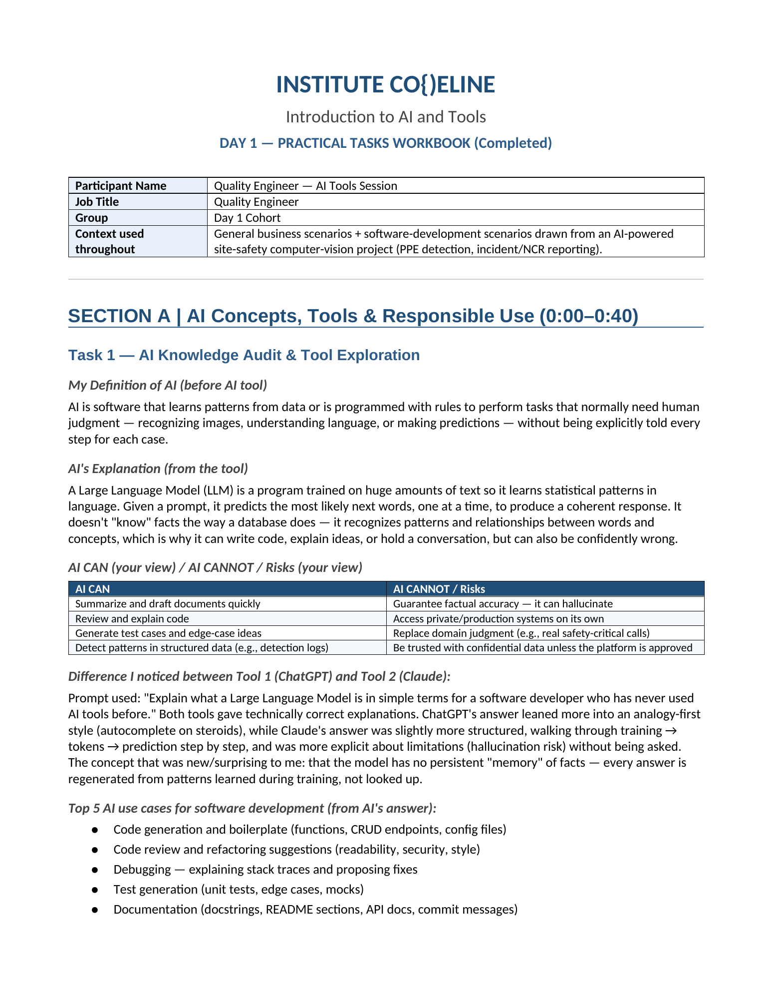
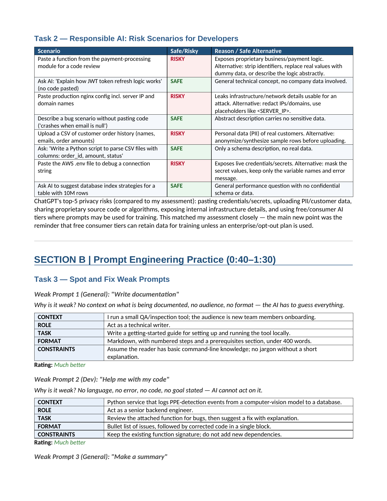
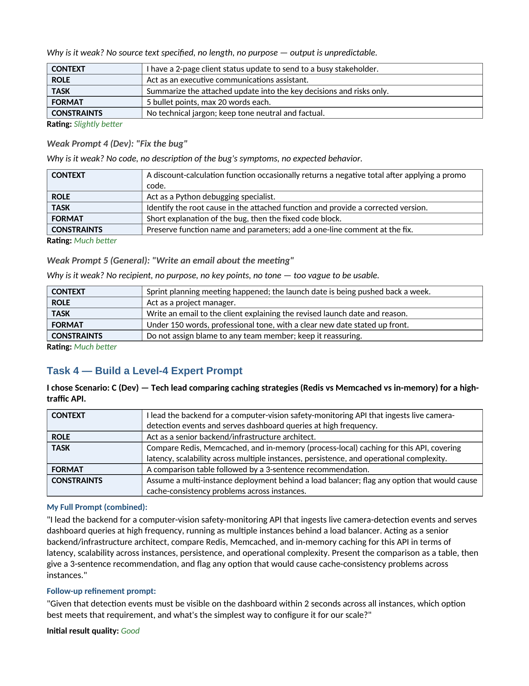
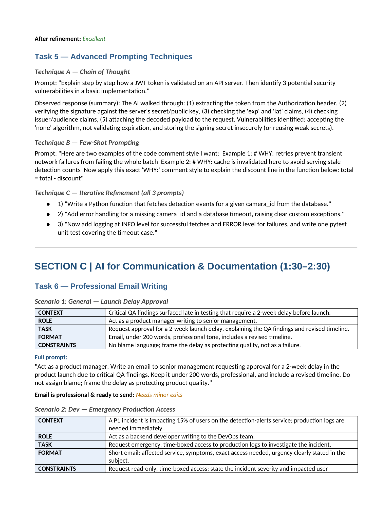
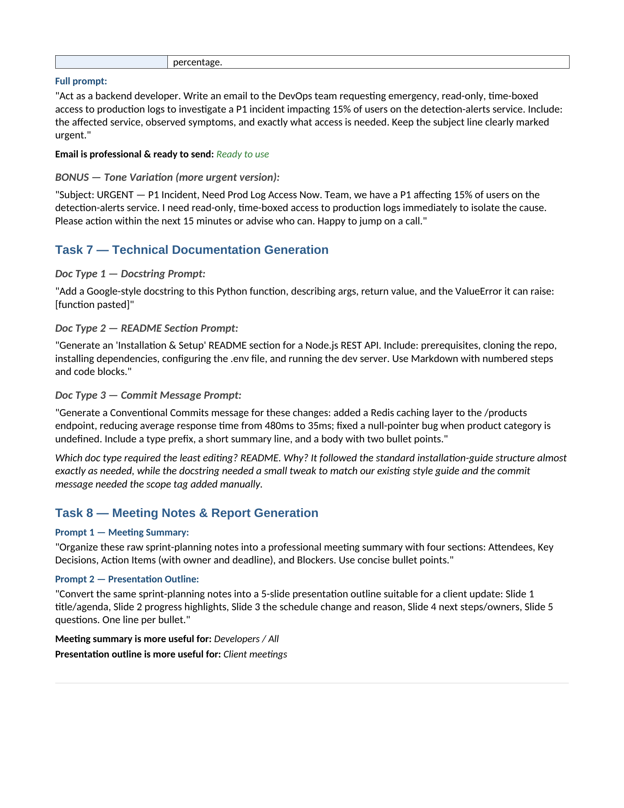
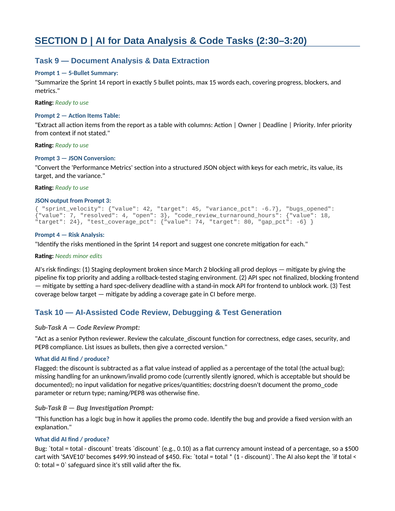
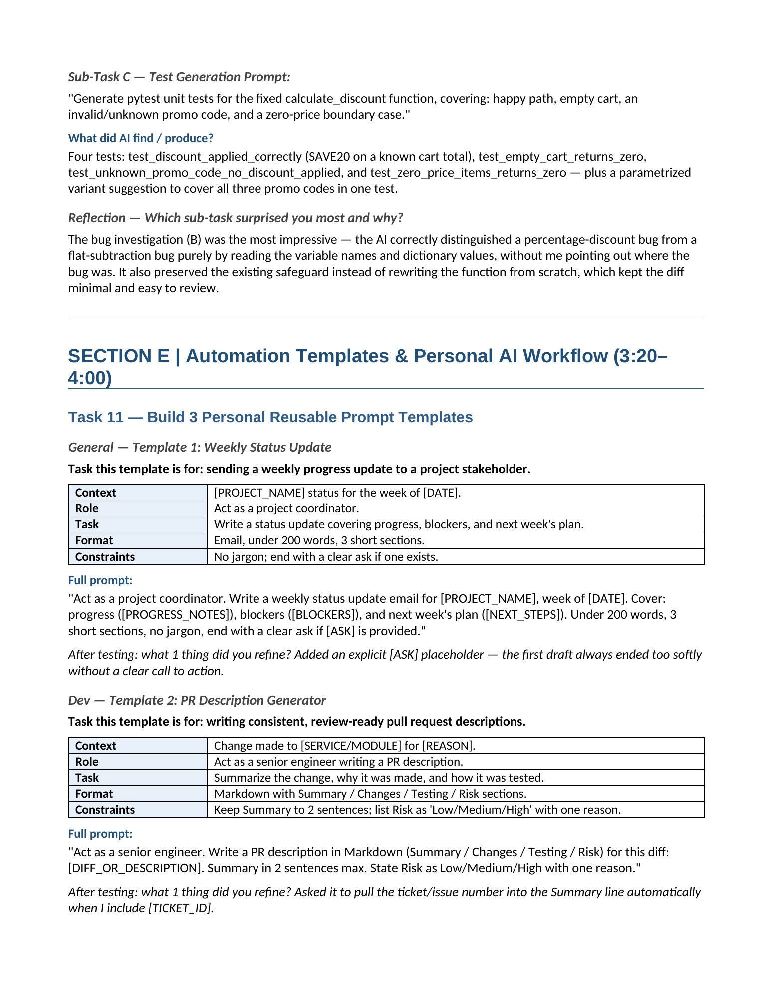
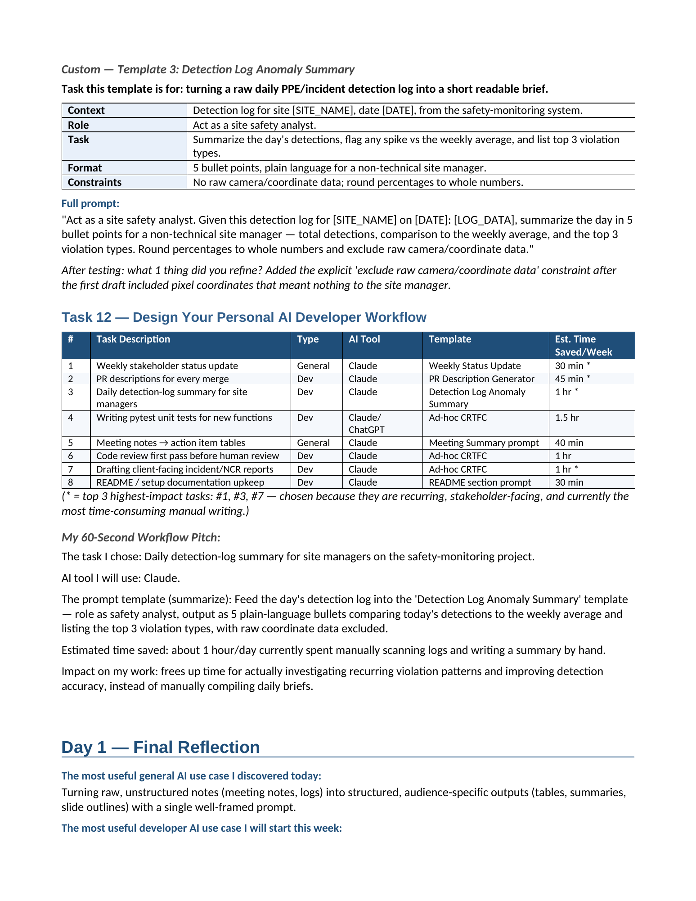
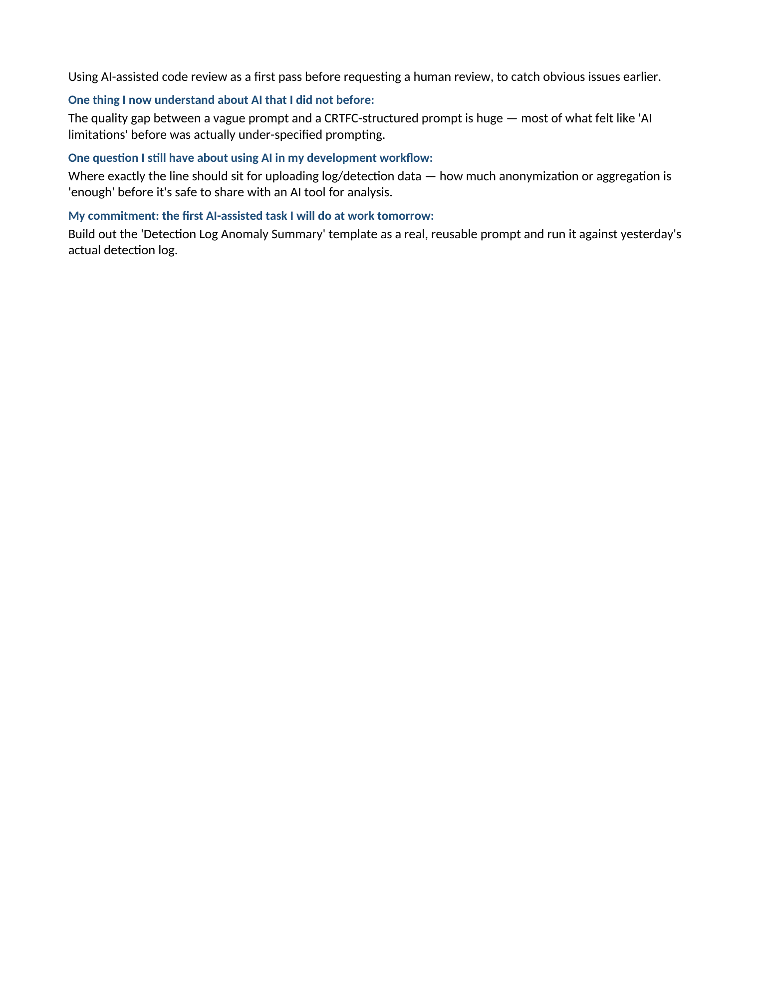

# AI Tasks and Projects

A repository for AI learning tasks and projects.

## Day 1

- [Download the completed tasks workbook](Day1_TasksWorkbook_Completed.docx)
- [View raw](https://github.com/M0hammedAlnajjar/AI-tasks-and-projects/raw/refs/heads/main/Day1_TasksWorkbook_Completed.docx)

Open the workbook in Microsoft Word or another application that supports `.docx` files.

### Workbook preview

All 9 pages are shown below. Click any image to open it at full size.

#### Page 1

#### Page 2

#### Page 3

#### Page 4

#### Page 5

#### Page 6

#### Page 7

#### Page 8

#### Page 9

